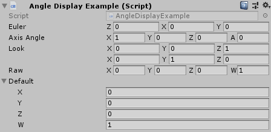

[#engine/angle-display-attribute]

## AngleDisplayAttribute

PiRhoSoft.UtilityEngine.AngleDisplayAttribute : https://docs.unity3d.com/ScriptReference/PropertyAttribute.html[PropertyAttribute^]

### Description

Attribute applied to https://docs.unity3d.com/ScriptReference/Quaternion.html[Quaternion^] fields to control how the rotation is displayed in the editor. By default, Unity displays https://docs.unity3d.com/ScriptReference/Quaternion.html[quaternions^] as a class with a foldout and 4 separate properties. Applying this attribute allows the rotation to be specified as a set of euler angles, a rotation about an axis, a look at and up vector, or as the 4 raw components.

[.text-center]

[source,cs]
----
using PiRhoSoft.UtilityEngine;
using UnityEngine;

namespace PiRhoSoft.UtilityExample
{
	[AddComponentMenu("PiRho Soft/Examples/Angle Display")]
	public class AngleDisplayExample : MonoBehaviour
	{
		[AngleDisplay] public Quaternion Euler = Quaternion.identity;
		[AngleDisplay(Type = AngleDisplayType.AxisAngle)] public Quaternion AxisAngle = Quaternion.identity;
		[AngleDisplay(Type = AngleDisplayType.Look)] public Quaternion Look = Quaternion.identity;
		[AngleDisplay(Type = AngleDisplayType.Raw)] public Quaternion Raw = Quaternion.identity;

		public Quaternion Default = Quaternion.identity;
	}
}
----

WARNING: Specifying the vectors for <<engine/angle-display-type.html,AxisAngle>> and <<engine/angle-display-type.html,Look>> display types can be finicky because of the translation back and forth from the underlying quaternion value (specifically due to the automatic normalization of the vectors). For <<engine/angle-display-type.html, AxisAngle>>, it is necessary to set the angle to something other than 0 in order to change the axis.

### Public Fields

<<engine/angle-display-type.html,AngleDisplayType>> _Type_::

By default this attribute will display the https://docs.unity3d.com/ScriptReference/Quaternion.html[Quaternion^] as a set of euler angles. Set this field to use one of the other <<engine/angle-display-type.html,display types>>.
