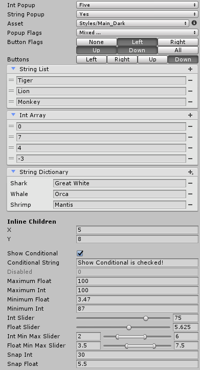

# Unity Utilities

A collection of MIT licensed general purpose utilities for use with Unity. Right now this consists of mostly editor controls and helper classes but more will be added. Contributions and feedback are welcome.



## Usage

**Using the Release Package**

1. download the unitypackage from the [releases page](https://github.com/pirhosoft/UnityUtilities/releases/latest)
2. in Unity, select *Assets/Import Package/Custom Package...* from the main menu
3. navigate to the downloaded file and open it
4. in the dialog, leave all files selected and click import

**Using the Source**

1. clone this repository
2. copy the *Assets/PiRhoSoft Utilities* folder to the *Assets* folder in your project

## Drawer Attributes

These attributes are added to serializable fields in editable classes (MonoBehaviours or ScriptableObjects) to enable custom drawing for the field. All attributes are in the ```PiRhoSoft.UtilityEngine``` namespace.

**IntPopup**

Add this to an int field to show a popup instead of the default text box. The constructor takes two parameters: an array of ints that are the values to select, and an array of strings that are shown as the label for each value.

```c#
[IntPopup(new int[] { 0, 5, 10 }, new string[] { "Zero", "Five", "Ten" })] public int IntPopup;
```

**StringPopup**

Add this to a string field to show a popup instead of the default text box. The constructor taken one parameter: the list of strings to show and select from in the popup.

```c#
[StringPopup(new string[] { "Yes", "No" })] public string StringPopup;
```

**AssetPopup**

Add this to a ScriptableObject or ScriptableObject derived field to show a popup listing the available assets of the correct type instead of the default asset picker. This will list assets based on their structure in the project folder so for some things it can be easier to find them with this rather than the default asset picker which instead provides a search function.

```c#
[AssetPopup] public ScriptableObject Asset;
```

Configuration properties:

| Property		| Description	| Default	|
| ------------- | ------------- | --------- |
| ShowNone		| Show a none option in the popup that sets the field value to `null` when selected	| `true`	|
| ShowEdit		| Show an edit button next to the popup to select the selected object in the inspector	| `true`	|
| ShowCreate	| Add a Create submenu to the end of the popup that will create and select a new asset of a specified type when selected	| `true`	|

**FlagsPopup**

Add this to an enum field to show Unity's EnumFlagsField (which lets you select multiple values) instead of the default enum popup (which only lets you select one value).

```c#
[FlagsPopup] public Buttons PopupFlags;
```

**EnumButtons**

Add this to an enum field to show a series of buttons for selecting the enum value rather than the default popup. If the enum type has the *Flags* attribute, the buttons will be toggleable and support multiple selections. Optionally set the *MinimumWidth* property (the default is 40) on the attribute to specify the smallest each button will be displayed, potentially making the field wrap to more lines in the inspector.

```c#
[Flags]
[EnumButtons] public Buttons ButtonFlags;
```

**ListDisplay**

Add this to a SerializedList or SerializedArray derived type to show a much more user friendly list editor than Unity's default. The implementation is based on Unity's undocumented ReorderableList class with lots of improvements.

Configuration properties:

| Property			| Description	| Default	|
| ----------------- | ------------- | --------- |
| AllowAdd			| Show an add button in the header that adds an item to the list	| `true`	|
| AllowRemove		| Show a remove button next to each item that removes the item from the list	| `true`	|
| AllowReorder		| Allow items to be dragged to change its location in the list	| `true`	|
| AllowCollapse		| Show a button in the header that collapses and expands the list contents - the collapsed state is persisted	| `true`	|
| InlineChildren	| When the list contains structures, display the fields of each item rather than the item itself	| `false`	|
| UseAssetPopup		| When the list contains Unity Objects, show a popup selector instead of the default asset picker	| `null`	|
| ShowEditButton	| When the list contains Unity Objects, show a button next to each item that selects the item in the inspector	| `false`	|
| EmptyText			| When the list is empty display this text - use an empty string to hide the label - null will show the default text "List is Empty"	| `null`	|

Further customization is possible by directly using the ListControl (or one of it's subclasses) in a custom Editor or ObjectControl.

```c#
[ListDisplay] public StringList StringList = new StringList();
```

**DictionaryDisplay**

Add this to a SerializedDictionary derived type to show a dictionary editor (by default dictionary editing is unsupported by Unity). This uses the same internals as ListDisplay.

Configuration properties:

| Property			| Description	| Default	|
| ----------------- | ------------- | --------- |
| AllowAdd			| Show an add button in the header that adds an item to the dictionary	| `true`	|
| AllowRemove		| Show a remove button next to each item that removes the item from the dictionary	| `true`	|
| AllowCollapse		| Show a button in the header that collapses and expands the dictionary contents - the collapsed state is persisted	| `true`	|
| InlineChildren	| When the dictionary contains structures, display the fields of each item rather than the item itself	| `false`	|
| ShowEditButton	| When the dictionary contains Unity Objects, show a button next to each item that selects the item in the inspector	| `false`	|
| AddLabel			| When AllowAdd is `true` display this text in the add popup - use an empty string to hide the label - null will show the default text "Add Item"	|
| EmptyText			| When the dictionary is empty display this text - use an empty string to hide the label - null will show the default text "List is Empty"	| `null`	|

Like ListDisplay, further customization can be made by using DictionaryControl from a custom Editor or ObjectControl.

```c#
[DictionaryDisplay] public StringDictionary StringDictionary = new StringDictionary();
```

**InlineDisplay**

Add this to a class or struct type with a *Serializable* attribute to show the fields of the class or struct inline rather than in a foldout. Optionally set the *PropagateLabel* field on the attribute (the default is `false`) to specify the label of the owning field should be used rather than the label for each of the fields in the class or struct. This can be useful for wrapper classes that contain a single field.

```c#
[InlineDisplay] public Vector2 InlineVector;
```

**ConditionalDisplay**

Add this to any field to hide the field in the inspector unless a different field is holding a specified value. Set the property name in the attribute constructor as well as the dependent value using named arguments. The dependent property can be a string, enum, int, float, bool, or Object. If it is an Object, the field is displayed based on whether the Object is null or not. If *HasReference* is `true` (the default) the field will be displayed when the property value is not `null`, If *HasReference* is `false` the field will be displayed when the property value is `null`.

```c#
public bool ShowConditional = true;
[ConditionalDisplay(nameof(ShowConditional), BoolValue = true)] public string ConditionalString;
```

Unfortunately, when using this attribute only the default editor for the field will be used. If the field type has a custom PropertyDrawer it will be ignored due to the way Unity internally resolves property drawers.

**DisableInInspector**

Add this to any field to disable editing of the field (while still showing it) in the inspector.

```c#
[DisableInInspector] public float Disabled;
```

**Maximum**

Add this to an int or float field to disallow selecting of a value higher than a specified value. Set the maximum value in the attribute constructor.

```c#
[Maximum(100.0f)] public float MaximumFloat;
```

**Minimum**

Add this to an int or float field to disallow selecting of a value lower than a specified value. Set the minimum value in the attribute constructor.

```c#
[Minimum(0.0f)] public float MinimumFloat;
```

**Slider**

Add this to an int or float field to show a slider instead of the default text box. Set the minimum, maximum, and snap values in the attribute constructor.

```c#
[Slider(0.0f, 10.0f, 1.125f)] public float FloatSlider;
```

**MinMaxSlider**

Add this to an int or float field to show a two value slider instead of the default text box. Set the minimum, maximum, and snap values in the attribute constructor. This attribute actually edits two fields - the one this is added to and the next field in the class. This should be added to the field that holds the beginning of the selected range with it's sibling holding the end. The sibling field should then be given a *HideInInspector* attribute to keep it from showing up.

```c#
[MinMaxSlider(0, 100, 5)] public int Minimum;
[HideInInspector] public int Maximum;
```

**Snap**

Add this to an int or float field to round the selected value to be a multiple of a specified value. Set the snap value in the attribute constructor.

```c#
[Snap(0.5f)] public float SnapFloat;
```

## Wrapper Classes

**SerializedList&lt;T&gt;**

This can be used just like the built in List class but because it isn't the built in List class can be targeted by PropertyDrawers. Because Unity doesn't serialize generic classes, though, it is necessary to subclass this for each type and give the subclass the *Serializable* attribute.

```c#
using System;
using PiRhoSoft.UtilityEngine;
using UnityEngine;

[Serializable] public class IntList : SerializedList<int> {}

public class ExampleBehaviour : MonoBehaviour
{
	[ListDisplay] public IntList List = new IntList();
}
```

**SerializedArray&lt;T&gt;**

This is exactly like *SerializedList* except for Arrays. The exception is *SerializedArray* must be constructed with a length.

```c#
using System;
using PiRhoSoft.UtilityEngine;
using UnityEngine;

[Serializable] public class IntArray : SerializedArray<int> { public IntArray(int count) : base(count) {} }

public class ExampleBehaviour : MonoBehaviour
{
	[ListDisplay] public IntArray Array = new IntArray(5);
}
```

**SerializedDictionary&lt;KeyType, ValueType&gt;**

And again for Dictionary.

```c#
using System;
using PiRhoSoft.UtilityEngine;
using UnityEngine;

[Serializable] public class IntDictionary : SerializedDictionary<string, int> {}

public class ExampleBehaviour : MonoBehaviour
{
	[DictionaryDisplay] public IntDictionary Dictionary = new IntDictionary();
}
```
